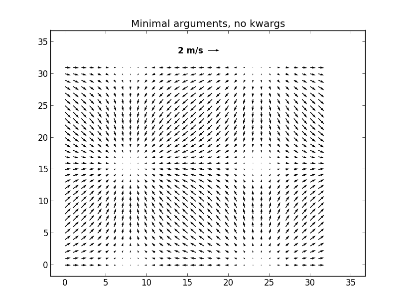
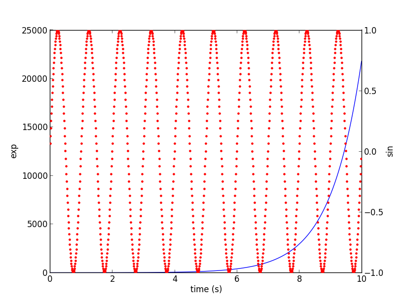

# Matplotlib
pylabはmatplotlibのオブジェクト指向ライブラリに対する手続き的インターフェース

# Environment
python 2.7

download following file.

http://peak.telecommunity.com/dist/ez_setup.py

easy_install SET UP

```
python ez_setup.py
```

PIP INSTALL

```
easy_install pip
```

Important Libraries INSTALL

```
pip install ipython
```

```
easy_install readline
```

```
pip install numpy
```

```
pip install matplotlib
```


###color
color.py - 線の色変更


colorline.py - 線種、線色、マーカー変更


line.py - 線種変更


###fig

fig01.py


fig02.py


fig03.py


fig04.py


fig05.py - 簡単な2Dグラフを描画


fig06.py - 円でグラフを描画


fig07.py


fig08.py


fig09.py


fig10.py


fig11.py


fig12.py


fig13.py


fig14.py - プログラム修正中


fig15.py - プログラム修正中


fig16.py


fig17.py


fig18.py


fig19.py - プログラム修正中


fig20.py


fig21.py


fig22.py - プログラム修正中


fig23.py


fig24.py - プログラム修正中


fig25.py


fig26.py


fig27.py


fig28.py


fig29.py


fig30.py


fig31.py


fig32.py




fig33.py


fig34.py - プログラム修正中


fig35.py


fig36.py


fig37.py - プログラム修正中


fig38.py



fig39.py - プログラム修正中


fig40.py


pie.py


#Copyright
PSF license
